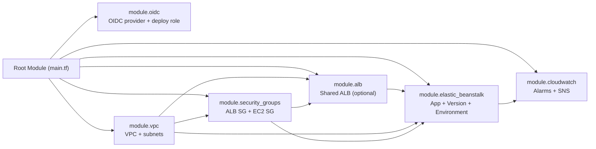

# Terraform Elastic Beanstalk Multi-Environment Deployment

Reusable Terraform modules for deploying AWS Elastic Beanstalk across `dev`, `qa`, and `prod` using Azure DevOps.

## Architecture


```mermaid
flowchart TB
    DEV["Developer / User\n(Terraform CLI)"]
    S3_STATE["AWS S3 Backend\nTerraform State"]
    
    DEV -->|terraform apply| S3_STATE

    subgraph DEV_ENV["AWS Dev Account"]
      D1["S3 Artifacts (dev)\n(Spring Boot JAR)"]
      D2["Shared ALB Module\n(Internet Facing)"]
      D3["Elastic Beanstalk Env\n(Autoscaling Group)"]
      D4["CloudWatch + SNS"]
      D1 -->|Deploy Application| D3
      D2 -->|Host-Based Routing\n(Custom CNAME)| D3
      D3 -->|Metrics & Health| D4
    end

    subgraph QA_ENV["AWS QA Account"]
      Q1["S3 Artifacts (qa)"]
      Q2["Shared ALB Module"]
      Q3["Elastic Beanstalk Env"]
      Q4["CloudWatch + SNS"]
      Q1 --> Q3
      Q2 --> Q3
      Q3 --> Q4
    end

    subgraph PROD_ENV["AWS Prod Account"]
      P1["S3 Artifacts (prod)"]
      P2["Shared ALB Module"]
      P3["Elastic Beanstalk Env"]
      P4["CloudWatch + SNS"]
      P1 --> P3
      P2 --> P3
      P3 --> P4
    end

    DEV -->|Deploy Infrastructure| DEV_ENV
    DEV -->|Deploy Infrastructure| QA_ENV
    DEV -->|Deploy Infrastructure| PROD_ENV
```

### Architecture (Text Fallback)

```text
Local Deployments via Terraform CLI
+- Terraform state -> AWS S3 backend
+- Deploy to AWS accounts
   +- Dev:  S3 artifact -> EB env (ASG) <- Shared ALB (Internet Facing)
            EB env -> CloudWatch/SNS
   +- QA:   S3 artifact -> EB env (ASG) <- Shared ALB (Internet Facing)
            EB env -> CloudWatch/SNS
   +- Prod: S3 artifact -> EB env (ASG) <- Shared ALB (Internet Facing)
            EB env -> CloudWatch/SNS

Shared Terraform modules:
- iam-roles         # Centralised IAM Profiles
- vpc               # Network Layer
- security-groups   # Resource Security Policies
- alb               # Shared Application Load Balancer
- elastic-beanstalk # Application Layer & ASG
- cloudwatch        # Monitoring & Alerting
```
## Key Design

- AWS remains the deployment provider.
- Terraform state is stored in Azure Blob (`azurerm` backend).
- Pipeline builds sample app, uploads ZIP to S3, then runs Terraform.
- Reusable modules are shared across all environments.
- Custom security groups are explicitly managed.
- ALB scheme is configurable (`internal` or `internet facing`).
- Elastic Beanstalk app environment variables are configurable via map.
- **Domain name** is configurable via `eb_environment_cname_prefix` → `<prefix>.<region>.elasticbeanstalk.com`.


## Step-by-Step Deployment Guide

Deployment is automated via **Azure DevOps Pipeline**. Simply push your code and the pipeline handles everything.

### Step 1: Configure Azure DevOps Variables

Set the following pipeline variables in Azure DevOps (Pipelines → Library or pipeline variables):

| Variable | Type | Description |
|---|---|---|
| `TF_STATE_RESOURCE_GROUP` | Plain | Azure resource group for Terraform state storage |
| `TF_STATE_STORAGE_ACCOUNT` | Plain | Azure storage account name |
| `TF_STATE_CONTAINER` | Plain | Azure blob container name |
| `TF_STATE_ACCESS_KEY` | Secret | Azure storage account access key |

### Step 2: Configure AWS OIDC Service Connections

Create AWS service connections in Azure DevOps (Project Settings → Service Connections):

| Service Connection | Environment | Used By |
|---|---|---|
| `aws-dev-oidc` | Dev | Dev stage |
| `aws-qa-oidc` | QA | QA stage |
| `aws-prod-oidc` | Prod | Prod stage |

### Step 3: Update Environment Configuration

Edit the `environments/*.tfvars` files with your actual values:

```bash
# environments/dev.tfvars
aws_account_id = "111111111111"    # Your dev AWS account
app_s3_bucket  = "my-app-artifacts-dev"
```

### Step 4: Push Code and Pipeline Runs Automatically

```bash
git add .
git commit -m "Deploy Elastic Beanstalk infrastructure"
git push origin main
```

The pipeline automatically executes for each environment:

```text
┌────────────────────────────────────────────────────────────────────────────┐
│  Build Stage                                                              │
│    mvn clean package → create ZIP bundle → publish artifact              │
├────────────────────────────────────────────────────────────────────────────┤
│  Dev Stage (on develop or main branch)                                   │
│    Upload bundle to S3 → terraform init → validate → plan → apply       │
│    -var-file=environments/dev.tfvars                                     │
├────────────────────────────────────────────────────────────────────────────┤
│  QA Stage (on main or release/* branch, after Dev succeeds)              │
│    Upload bundle to S3 → terraform init → validate → plan → apply       │
│    -var-file=environments/qa.tfvars                                      │
├────────────────────────────────────────────────────────────────────────────┤
│  Prod Stage (on main branch only, after QA succeeds)                     │
│    Upload bundle to S3 → terraform init → validate → plan → apply       │
│    -var-file=environments/prod.tfvars                                    │
└────────────────────────────────────────────────────────────────────────────┘
```

> The pipeline template (`templates/terraform-job.yml`) handles `terraform init` with Azure Blob backend, `validate`, `plan`, and `apply` — **no manual CLI commands needed.**

---

### Pipeline Stage Triggers

| Stage | Branch Trigger | Depends On |
|---|---|---|
| Build | `main`, `develop`, `release/*` | — |
| Dev | `develop`, `main` | Build |
| QA | `main`, `release/*` | Dev |
| Prod | `main` only | QA |

---

<details>
<summary><b>Optional: Local / Manual Deployment (for testing)</b></summary>

If you need to run Terraform locally (e.g., for debugging), use the `.tfbackend` files:

#### Prerequisites

```bash
terraform --version        # >= 1.5.0
aws sts get-caller-identity
```

#### Deploy to DEV

```bash
terraform init -reconfigure -backend-config=environments/dev.tfbackend
terraform validate
terraform plan -var-file=environments/dev.tfvars
terraform apply -var-file=environments/dev.tfvars
terraform output
```

#### Deploy to QA

```bash
terraform init -reconfigure -backend-config=environments/qa.tfbackend
terraform validate
terraform plan -var-file=environments/qa.tfvars
terraform apply -var-file=environments/qa.tfvars
terraform output
```

#### Deploy to PROD

```bash
terraform init -reconfigure -backend-config=environments/prod.tfbackend
terraform validate
terraform plan -var-file=environments/prod.tfvars
terraform apply -var-file=environments/prod.tfvars
terraform output
```

#### Destroy an Environment

```bash
terraform init -reconfigure -backend-config=environments/dev.tfbackend
terraform destroy -var-file=environments/dev.tfvars
```

> ⚠️ Resources with `prevent_destroy = true` will block destruction. Remove the lifecycle block first if you intend to destroy.

#### Useful Commands

```bash
terraform fmt -recursive              # Format all files
terraform validate                     # Validate syntax
terraform show                         # Show current state
terraform state list                   # List all resources
terraform output eb_domain_name        # View specific output
```

</details>


## Environment Configuration Files

| File | Region | Instance | ASG | Log Retention |
|---|---|---|---|---|
| `environments/dev.tfvars` | us-east-1 | t3.micro | 1–2 | 14 days |
| `environments/qa.tfvars` | us-east-1 | t3.small | 2–4 | 30 days |
| `environments/prod.tfvars` | us-east-1 | t3.medium | 2–6 | 90 days |

These files control environment-specific values including:

- Account ID and region
- VPC CIDRs
- EB sizing and platform
- Custom security group rules
- EB environment name, domain (CNAME prefix), description
- ALB scheme (`internal` / `internet facing`)
- `eb_environment_variables` map

## Key Outputs

| Output | Description |
|---|---|
| `eb_domain_name` | Full EB domain (e.g. `myapp-dev.us-east-1.elasticbeanstalk.com`) |
| `eb_endpoint_url` | EB environment endpoint URL |
| `eb_cname` | EB environment CNAME |
| `vpc_id` | VPC ID |
| `cloudwatch_alarm_arns` | Map of CloudWatch alarm ARNs |

## Modules

| Module | Purpose |
|---|---|
| `modules/oidc` | IAM OIDC provider + deploy role |
| `modules/vpc` | VPC, subnets, IGW, NAT, route tables |
| `modules/security-groups` | ALB SG + EC2 SG |
| `modules/alb` | **Shared ALB** for multi-app support (optional) |
| `modules/elastic-beanstalk` | EB app, version, environment, IAM roles |
| `modules/cloudwatch` | CloudWatch alarms + SNS topic |

## Module Dependency Flow



## Project Structure

```text
Terraform-EBStalk/
├── azure-pipelines.yml          # CI/CD pipeline definition
├── templates/
│   └── terraform-job.yml        # Reusable pipeline template
├── providers.tf                 # AWS provider + Azure Blob backend
├── main.tf                      # Root module orchestration
├── variables.tf                 # Input variable declarations
├── outputs.tf                   # Output definitions
├── environments/
│   ├── dev.tfbackend             # Dev backend config (state key)
│   ├── dev.tfvars               # Dev environment config
│   ├── qa.tfbackend              # QA backend config (state key)
│   ├── qa.tfvars                # QA environment config
│   ├── prod.tfbackend            # Prod backend config (state key)
│   └── prod.tfvars              # Prod environment config
├── modules/
│   ├── oidc/                    # IAM OIDC + deploy role
│   ├── vpc/                     # VPC + subnets + gateways
│   ├── security-groups/         # ALB SG + EC2 SG
│   ├── alb/                     # Shared ALB (optional, multi-app)
│   ├── elastic-beanstalk/       # EB app + env + ASG + ALB
│   └── cloudwatch/              # Alarms + SNS
├── docs/
│   ├── architecture.png         # Architecture diagram (image)
│   └── architecture.svg         # Architecture diagram (SVG)
└── sample-app/                  # Sample Java application
```


