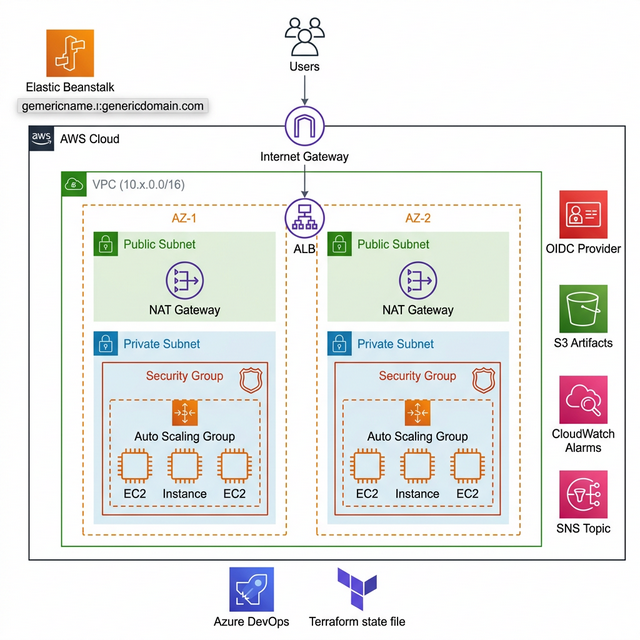
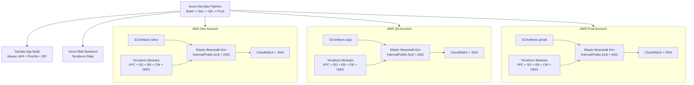
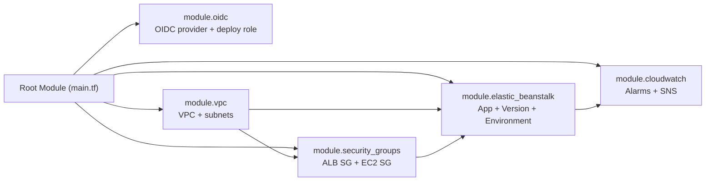

# Terraform Elastic Beanstalk Multi-Environment Deployment

Reusable Terraform modules for deploying AWS Elastic Beanstalk across `dev`, `qa`, and `prod` using Azure DevOps.

## Architecture



> 💡 **Editable version:** [architecture.drawio](docs/architecture.drawio) — open in [draw.io](https://app.diagrams.net/) or VS Code draw.io extension.




### Architecture (Text Fallback)

```text
Azure DevOps Pipeline (Build -> Dev -> QA -> Prod)
+- Build sample app (Maven) -> app bundle ZIP
+- Terraform state -> Azure Blob backend
+- Deploy to AWS accounts
   +- Dev:  S3 artifact -> EB env (ALB + ASG) -> CloudWatch/SNS
   +- QA:   S3 artifact -> EB env (ALB + ASG) -> CloudWatch/SNS
   +- Prod: S3 artifact -> EB env (ALB + ASG) -> CloudWatch/SNS

Shared Terraform modules:
- oidc
- vpc
- security-groups
- elastic-beanstalk
- cloudwatch
```
## Key Design

- AWS remains the deployment provider.
- Terraform state is stored in Azure Blob (`azurerm` backend).
- Pipeline builds sample app, uploads ZIP to S3, then runs Terraform.
- Reusable modules are shared across all environments.
- Custom security groups are explicitly managed.
- ALB scheme is configurable (`internal` or `internet facing`).
- Elastic Beanstalk app environment variables are configurable via map.
- **Domain name** is configurable via `eb_environment_cname_prefix` → `<prefix>.<region>.elasticbeanstalk.com`.


## Step-by-Step Deployment Guide

### Prerequisites

Before deploying, ensure the following are in place:

```bash
# 1. Install Terraform (>= 1.5.0)
terraform --version

# 2. Verify AWS CLI is configured
aws sts get-caller-identity

# 3. Create an S3 bucket for application artifacts (one per environment)
aws s3 mb s3://my-app-artifacts-dev --region us-east-1
aws s3 mb s3://my-app-artifacts-qa --region us-east-1
aws s3 mb s3://my-app-artifacts-prod --region us-east-1

# 4. Upload your application JAR/WAR to S3
aws s3 cp target/my-app-v1.jar s3://my-app-artifacts-dev/releases/my-app-v1.jar
```

---

### Step 1: Deploy to DEV Environment

```bash
# 1.1 Initialize Terraform with DEV backend config
terraform init -reconfigure -backend-config=environments/dev.tfbackend

# 1.2 Validate the configuration
terraform validate

# 1.3 Preview the changes for DEV
terraform plan -var-file=environments/dev.tfvars

# 1.4 Apply the changes to DEV
terraform apply -var-file=environments/dev.tfvars

# 1.5 Verify the deployment outputs
terraform output
```

> After `apply`, note the output values:
> - `eb_domain_name` → e.g. `myapp-dev.us-east-1.elasticbeanstalk.com`
> - `eb_endpoint_url` → the environment endpoint URL
> - `vpc_id` → the created VPC ID

---

### Step 2: Deploy to QA Environment

```bash
# 2.1 Initialize Terraform with QA backend config
terraform init -reconfigure -backend-config=environments/qa.tfbackend

# 2.2 Validate the configuration
terraform validate

# 2.3 Preview the changes for QA
terraform plan -var-file=environments/qa.tfvars

# 2.4 Apply the changes to QA
terraform apply -var-file=environments/qa.tfvars

# 2.5 Verify the deployment outputs
terraform output
```

> QA uses `t3.small` instances with min 2 / max 4 ASG and stricter CloudWatch thresholds.

---

### Step 3: Deploy to PROD Environment

```bash
# 3.1 Initialize Terraform with PROD backend config
terraform init -reconfigure -backend-config=environments/prod.tfbackend

# 3.2 Validate the configuration
terraform validate

# 3.3 Preview the changes for PROD (always review carefully!)
terraform plan -var-file=environments/prod.tfvars

# 3.4 Apply the changes to PROD
terraform apply -var-file=environments/prod.tfvars

# 3.5 Verify the deployment outputs
terraform output
```

> ⚠️ **PROD** uses `t3.medium` instances with min 2 / max 6 ASG, 90-day log retention, and tighter alarm thresholds (CPU 70%, latency 1.0s).

---

### Destroy an Environment

To tear down an environment (e.g. dev):

```bash
# Initialize with the target environment's backend config
terraform init -reconfigure -backend-config=environments/dev.tfbackend

# Destroy all resources for DEV
terraform destroy -var-file=environments/dev.tfvars

# For QA
terraform init -reconfigure -backend-config=environments/qa.tfbackend
terraform destroy -var-file=environments/qa.tfvars

# For PROD (use with extreme caution!)
terraform init -reconfigure -backend-config=environments/prod.tfbackend
terraform destroy -var-file=environments/prod.tfvars
```

> ⚠️ Resources with `prevent_destroy = true` will block destruction. Remove the lifecycle block first if you intend to destroy.


---

### Useful Commands

```bash
# Format all Terraform files
terraform fmt -recursive

# Validate syntax without applying
terraform validate

# Show current state
terraform show

# List all resources in state
terraform state list

# View a specific output
terraform output eb_domain_name

# Import an existing resource
terraform import -var-file=environments/dev.tfvars <resource_address> <resource_id>
```

## CI/CD Pipeline (Azure DevOps)

The `azure-pipelines.yml` automates the above steps:

1. **Build Stage** — Build sample app (Maven) → create EB bundle ZIP
2. **Dev Stage** — Upload artifact to S3 → `terraform init` → `terraform plan` → `terraform apply -var-file=environments/dev.tfvars`
3. **QA Stage** — Upload artifact to S3 → `terraform init` → `terraform plan` → `terraform apply -var-file=environments/qa.tfvars`
4. **Prod Stage** — Upload artifact to S3 → `terraform init` → `terraform plan` → `terraform apply -var-file=environments/prod.tfvars`

### Required Azure DevOps Variables

| Variable | Type | Description |
|---|---|---|
| `TF_STATE_RESOURCE_GROUP` | Plain | Azure resource group for Terraform state |
| `TF_STATE_STORAGE_ACCOUNT` | Plain | Azure storage account name |
| `TF_STATE_CONTAINER` | Plain | Azure blob container name |
| `TF_STATE_ACCESS_KEY` | Secret | Azure storage access key |

## Environment Configuration Files

| File | Region | Instance | ASG | Log Retention |
|---|---|---|---|---|
| `environments/dev.tfvars` | us-east-1 | t3.micro | 1–2 | 14 days |
| `environments/qa.tfvars` | us-east-1 | t3.small | 2–4 | 30 days |
| `environments/prod.tfvars` | us-east-1 | t3.medium | 2–6 | 90 days |

These files control environment-specific values including:

- Account ID and region
- VPC CIDRs
- EB sizing and platform
- Custom security group rules
- EB environment name, domain (CNAME prefix), description
- ALB scheme (`internal` / `internet facing`)
- `eb_environment_variables` map

## Key Outputs

| Output | Description |
|---|---|
| `eb_domain_name` | Full EB domain (e.g. `myapp-dev.us-east-1.elasticbeanstalk.com`) |
| `eb_endpoint_url` | EB environment endpoint URL |
| `eb_cname` | EB environment CNAME |
| `vpc_id` | VPC ID |
| `cloudwatch_alarm_arns` | Map of CloudWatch alarm ARNs |

## Modules

| Module | Purpose |
|---|---|
| `modules/oidc` | IAM OIDC provider + deploy role |
| `modules/vpc` | VPC, subnets, IGW, NAT, route tables |
| `modules/security-groups` | ALB SG + EC2 SG |
| `modules/elastic-beanstalk` | EB app, version, environment, IAM roles |
| `modules/cloudwatch` | CloudWatch alarms + SNS topic |

## Module Dependency Flow



## Project Structure

```text
Terraform-EBStalk/
├── azure-pipelines.yml          # CI/CD pipeline definition
├── templates/
│   └── terraform-job.yml        # Reusable pipeline template
├── providers.tf                 # AWS provider + Azure Blob backend
├── main.tf                      # Root module orchestration
├── variables.tf                 # Input variable declarations
├── outputs.tf                   # Output definitions
├── environments/
│   ├── dev.tfbackend             # Dev backend config (state key)
│   ├── dev.tfvars               # Dev environment config
│   ├── qa.tfbackend              # QA backend config (state key)
│   ├── qa.tfvars                # QA environment config
│   ├── prod.tfbackend            # Prod backend config (state key)
│   └── prod.tfvars              # Prod environment config
├── modules/
│   ├── oidc/                    # IAM OIDC + deploy role
│   ├── vpc/                     # VPC + subnets + gateways
│   ├── security-groups/         # ALB SG + EC2 SG
│   ├── elastic-beanstalk/       # EB app + env + ASG + ALB
│   └── cloudwatch/              # Alarms + SNS
├── docs/
│   ├── architecture.png         # Architecture diagram (image)
│   ├── architecture.svg         # Architecture diagram (SVG)
│   └── architecture.drawio      # Architecture diagram (editable)
└── sample-app/                  # Sample Java application
```


